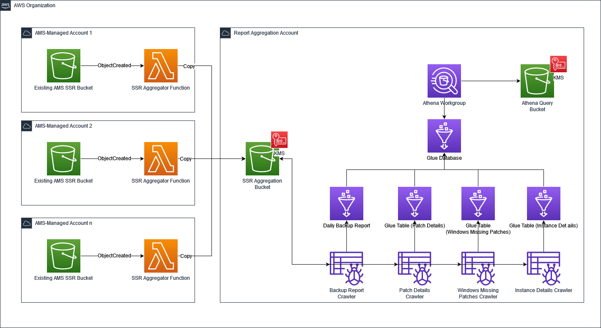
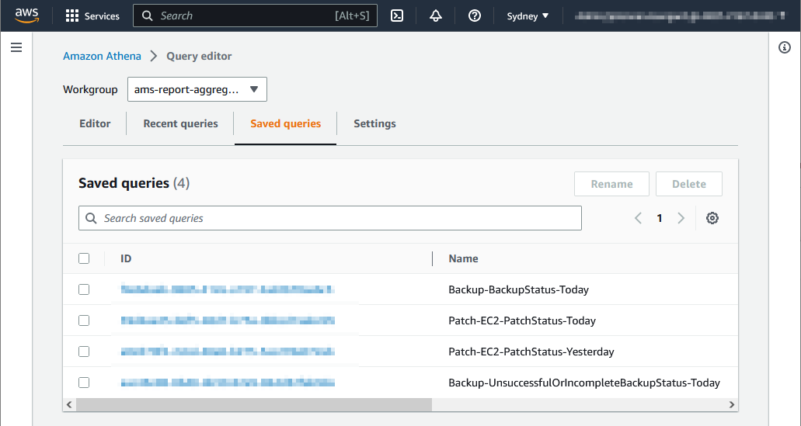

# self-service-reporting-aggregator

_N.B. This package is compatible with AMS Accelerate only, it is unable to be deployed into AMS Advanced Landing Zones at this time._

## Introduction

[AWS Managed Services ("AMS")](https://aws.amazon.com/managed-services/) provides a range of operational services to help AWS customers achieve operational excellence on AWS.

AMS Self-Service Reporting (SSR) provides AMS customers with insights into the performance of services delivered by AMS. For example, AMS customers can use SSR to understand the status of EC2 Instance patching, or the percentage of successful Backup jobs.

AMS SSR provides AMS Customers with account-level reporting. This helps AWS account owners to understand the performance of AMS's Patching and Backup services within individual AWS account.

Further reading: [AMS Accelerate SSR](https://docs.aws.amazon.com/managedservices/latest/accelerate-guide/self-service-reporting.html); [AMS Advanced SSR](https://docs.aws.amazon.com/managedservices/latest/userguide/self-service-reporting.html)

## What does this package do?

Enterprises typically designate teams that govern the performance of the enterprise as a whole. For example, Enterprise Security teams wish to understand the patch status of all EC2 instances in all AWS Accounts. Business Continuity teams wish to understand the overall status of the organization's backups.

After deploying the CloudFormation templates provided in this package, AMS SSR reports from individual member AWS Accounts will be copied into a centralized AWS Account (aggregator account). Once the SSR reports are located in the aggregator account, they can be queried using [Amazon Athena](https://aws.amazon.com/athena/) which provides an organizational level report, rather than an account-level report.

## Pre-requisites

- [AMS Accelerate](https://docs.aws.amazon.com/managedservices/latest/accelerate-guide/what-is-acc.html) must be enabled on the AWS Organization member account(s)
- The CloudFormation Stack and StackSet in this repository are designed to be deployed within the same [AWS Organization](https://docs.aws.amazon.com/organizations/latest/userguide/orgs_introduction.html). This package is not designed to be deployed across multiple AWS Organizations.
- AMS Self-Service Reporting must be enabled on the member account(s)
- AMS must have already created, and be publishing SSR reports in each member account to the S3 bucket matching the following pattern `^ams\-reporting\-data\-a[0-9]{12}$`

## Prior to deployment

- 🚨 You must carefully consider who in your organization has access to, and the ability to query the source and aggregated data produced by this package.
- 🚨 It is good practice to review the code and templates in this package prior to deployment.

## Deployment

### Template #1 - deployed into a centralized reporting account of your choice. This account should be within the same AWS Organization as AWS accounts managed by AMS.

#### Filename:

`template-aggregation-account.yml`

#### CloudFormation Parameters:

- `AWSOrganizationId` is the unique identifier for the AWS Organization into which this package is being deployed. Find your AWS Organization ID by following the steps documented on [this page](https://docs.aws.amazon.com/organizations/latest/userguide/orgs_manage_org_details.html).
- `DailyBackupCrawlerSchedule` is a cron expression representing the time the Glue Crawler should crawl for new reports. The cron expects 6 parts separated by whitespace, for example `cron(0 21 * * ? *)`
- `PatchDetailsCrawlerSchedule` is a cron expression representing the time the Glue Crawler should crawl for new reports. The cron expects 6 parts separated by whitespace, for example `cron(0 21 * * ? *)`
- `InstanceDetailsCrawlerSchedule` is a cron expression representing the time the Glue Crawler should crawl for new reports. The cron expects 6 parts separated by whitespace, for example `cron(0 21 * * ? *)`
- `WindowsMissingCrawlerSchedule` is a cron expression representing the time the Glue Crawler should crawl for new reports. The cron expects 6 parts separated by whitespace, for example `cron(0 21 * * ? *)`

_This package expects AMS SSR to publish new SSR reports into your AMS-Managed AWS Account by 21:00 UTC each day._

#### CloudFormation Outputs:

- `AggregatorAggregationBucketName` is the name of the S3 bucket into which reports can be copied (from member accounts)
- `AggregatorKMSKeyArn` is the KMS Key ARN that encrypts objects in S3 buckets in this package.
- `AggregatorAthenaPolicyArn` is the ARN of an IAM Managed Policy which will allow an IAM Principal to use this package.

_Outputs `AggregatorAggregationBucketName` and `AggregatorKMSKeyArn` are used as inputs to CloudFormation Parameters in Template #2 (see below)_

_Output `AggregatorAthenaPolicyArn` is described in the section `Consuming data from Athena` in this readme (see below)_

### Template #2 - deployed into individual AMS-Managed member accounts as a CloudFormation Stack, or into multiple AMS-Managed member accounts as a CloudFormation StackSet

#### Filename:

`template-member-accounts.yml`

#### CloudFormation Parameters:

- `ReportAggregatorBucketName` is the name of an S3 bucket created by Template #1. This S3 bucket is used to store all of the AWS Organization's AMS SSR reports.

- `ReportAggregatorKMSKeyArn` is the ARN of a KMS Key created by Template #1. This KMS Key encrypts the contents of S3 buckets deployed by this package.

## Consuming data from Athena

### Access

The CloudFormation template `template-aggregation-account.yml` deploys an IAM Managed Policy `AggregatorAthenaPolicy`, which can be attached to an IAM Role that has Athena Access (for example: [Athena Full Access](https://docs.aws.amazon.com/athena/latest/ug/managed-policies.html#amazonathenafullaccess-managed-policy)). This Managed Policy provides additional permissions that allow an IAM Principal to encrypt/decrypt data using the KMS key deployed by this package, and access the S3 buckets deployed by this package.

**🚨 You must carefully consider who in your organization has access to, and the ability to query the data consumed and produced by this package.**

### Querying the aggregated data

To get started querying aggregated data, from the Athena Console in the report aggregation account, 4x example "Saved Queries" have been provided. These queries are accessible via the `Saved Query` tab within the `ams-report-aggregator-workgroup` Athena Workgroup. These queries are intended as examples only. As this is an Open Source project, contributions from the community are welcome. See [CONTRIBUTING](CONTRIBUTING.md) for more information.

## How much does this cost?

The cost to operate this package is based on a number of factors that are unique to your AWS environment, therefore they cannot be estimated in this readme file. For example:

- The file size of the reports in each individual AWS account from which data is sourced;
- The number of AWS Accounts from which data is sourced;
- The amount of data transferred and stored;
- The amount of data processed by Glue Crawlers in the Aggregator account;
- The amount of data that Athena processes when executing SQL queries on aggregated data;
- The number of times you use Athena to query aggregated data.

In November 2022 this package was deployed in a development environment consisting of 8x AWS accounts. The total AWS charges (across all 8x AWS accounts) for this package was less than $10 USD for the month.

**🚨 Your experience will differ, therefore you must estimate cost before deploying this package in your environment.**

### Tips to optimize the cost of this package

- You can minimize storage costs by deleting or archiving unused reports with [Amazon S3 lifecycle configurations](https://docs.aws.amazon.com/AmazonS3/latest/userguide/object-lifecycle-mgmt.html) in the Aggregator account.
- You can reduce AWS Glue costs by reducing the frequency at which Glue Crawlers crawl new data.
- This package aggregates 4x AMS Self-Service Reporting reports. You can modify this package to disable the aggregation of reports that you do not intend to consume.

## Security

See [CONTRIBUTING](CONTRIBUTING.md#security-issue-notifications) for more information.

## License

This library is licensed under the MIT-0 License. See the LICENSE file.
