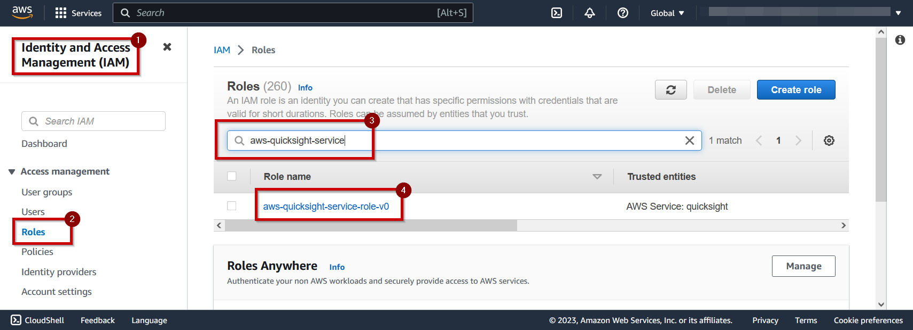
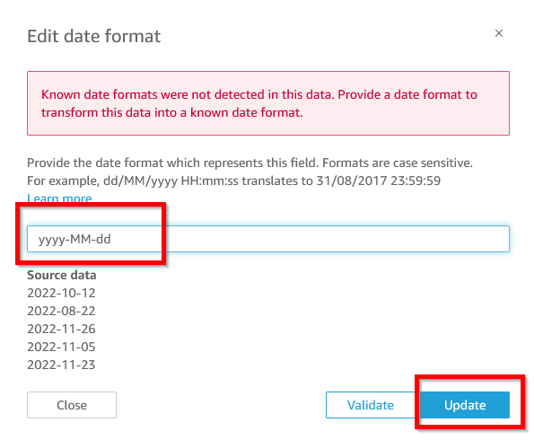
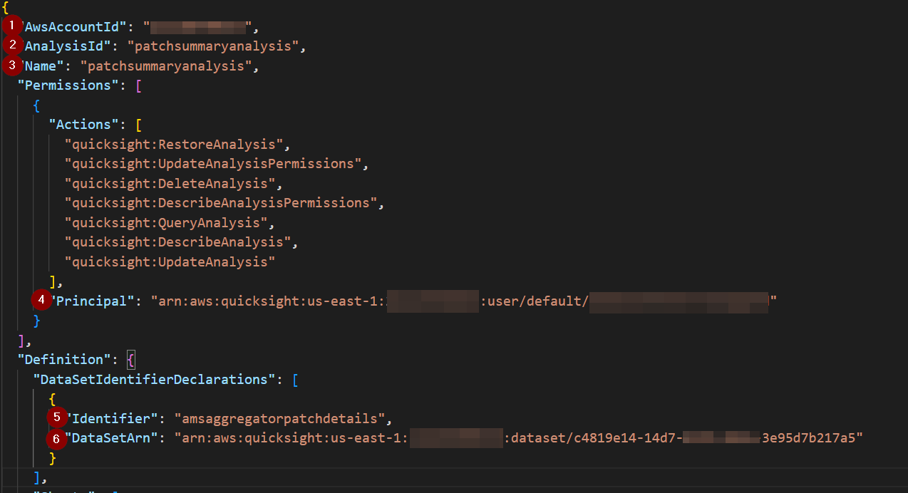
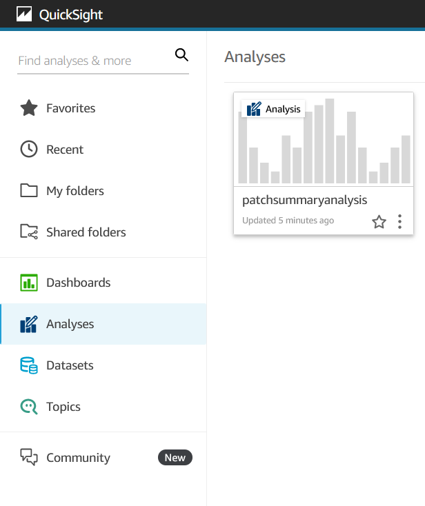

# Example Dashboard - Patch Details

This readme file describes how to create a QuickSight Analysis to visualize AMS Patch Reports and gain useful insights about patch compliance in your organization. The analysis can be deployed after deploying the Self Service Aggregator solution.

**N.B. Amazon QuickSight comes with additional charges, and may require you to enter into a subscription. You must, therefore, manually deploy the dashboard after considering QuickSight pricing [at this url](https://aws.amazon.com/quicksight/pricing/).**

## Prerequisites

This readme assumes you have some familiarity with Amazon QuickSight, and that you have gone through the [QuickSight setup process](https://docs.aws.amazon.com/quicksight/latest/user/setting-up.html) in your AWS Account and Region where the SSR Aggregator core stack has been deployed.

## Preview

The following screenshots were taken from QuickSight in order to provide examples of the visualizations that are available once you have deployed this sample code.

## Part 1 of 4, IAM Setup

1. Navigate to the IAM Console, search for your QuickSight Service Role (the default one is pictured, however if you use a custom QuickSight Service role, you should search for your custom role instead).

   

2. Select `Add Permissions` and then select `Attach Policies`

   

3. Search for `AggregatorAthenaPolicy` as pictured, then select the corresponding IAM role, and then choose the `Add Permissions` button.

   

## Part 2 of 4, Create a Data Source in Amazon QuickSight

1. Navigate to Amazon QuickSight in the AWS Console, and select "Datasets" from the navigation pane.
2. Select `New dataset`.

   

3. Select `Athena` from `Create a Dataset 'From new data sources'`.

   

4. Give the Data Source a name (for example, `ams_ssr`), select the `ams-report-aggregator-workgroup`, and select `Validate Connection`. Upon successful validation, select `Create data source`.

   

5. On the `Choose your table` view, select the `amsaggregatordatabase`, select the `amsaggregatorpatchdetails` Table, and select `Edit/Preview data`.

   

6. From the navigation pane's `Fields` section
7. From the menu beside `instance_state` and also beside `window_state`, select the option to `Change data type` from `State` to `String`. If the option is not present, there is no action to take, because QuickSight was able to automatically detect "String" (which is correct).

   

8. From the menu beside `reportdate`, select the option to `Change data type` from `String` to `Date`. Specify the date format as `yyyy-MM-dd`.

   

9. From each menu beside `compliant_critical`, `compliant_high`,`compliant_medium`,`compliant_low`,`compliant_informational`, `compliant_unspecified`, `compliant_total`,`noncompliant_critical`, `noncompliant_high`,`noncompliant_medium`,`noncompliant_low`,`noncompliant_informational`, `noncompliant_unspecified`, `noncompliant_total` select the option to `Change data type` from `String` to `Integer`. If the option does not exist, it means QuickSight has automatically inferred "Integer" as the correct data type.

9. (1) Note that the name of this Data Set is `amsaggregatorpatchdetails`. If you use a different name, you'll have additional work to do later. (2) Click on `Save and Publish`. (3) After saving, note the ID of your Dataset from your browser URL.

   

## Part 3 of 4, Edit `skeleton.json`

`skeleton.json` is a file that describes how your QuickSight report will look and feel, as well as the underlying data used to visualize the Analysis. You can use `skeleton.json` as an example when building your own QuickSight analysis later on. You can find `skeleton.json` in this repository at this URL
[https://github.com/aws-samples/ams-self-service-reporting-aggregator/blob/main/quicksight-examples/patch-details/skeleton.json](https://github.com/aws-samples/ams-self-service-reporting-aggregator/blob/main/quicksight-examples/patch-details/skeleton.json)

1. Edit a copy of `skeleton.json` and update the file with data you received from Step 1, and from information you know about your AWS Account (for example, your AWS Account Id).
2. The following are a list of values that you need to know/provide when updating `skeleton.json`.

   - **AwsAccountId** – the AWS Account ID you are deploying this analysis into
   - **AnalysisId** – Give your analysis an Id, for example `patchsummaryanalysis`
   - **Name** – Give your analysis a name, for example `patchsummaryanalysis`
   - **Permissions** – The `skeleton.json` provides an example QuickSight Administrative user. Later, this Principal will be able to assign permissions to other Principals who need access to this QuickSight analysis. To retrieve the ARN for your QuickSight Administrator, run the following command `aws quicksight list-users --aws-account-id REPLACE_ME --namespace default`
     
   - **Identifier** – This is the name of the DataSet name from Part 1. If you chose a name other than `amsaggregatorpatchdetails`, you'll need to do a find and replace for this value throughout the `skeleton.json`, as there are lots of places where this string needs to exist.

     

   - **DataSetArn** – This is the ARN for the Data Set you created in Part 1. You will need to construct a full ARN from the ID you copied from the browser URL.
     `arn:aws:quicksight:REPLACE_ME_AWS_REGION:REPLACE_ME_AWS_ACCOUNT_ID:dataset/REPLACE_ME_DATA_SET_ID_FROM_BROWSER_ADDRESS_BAR`

## Part 4 of 4, Creating the template in QuickSight

Using the [AWS Command Line Interface (CLI)](https://aws.amazon.com/cli/), run the following command. This command assumes you have adequate QuickSight permissions to execute the [CreateAnalysis API](https://docs.aws.amazon.com/quicksight/latest/APIReference/API_CreateAnalysis.html). Replace `file://./skeleton.json` with the correct path to the `skeleton.json` file you edited during Step 2.

`aws quicksight create-analysis --cli-input-json file://./skeleton.json`

You can monitor your progress with this command

`aws quicksight list-analyses --aws-account-id REPLACE_ME`

In the event of a failure, you can inspect a failed creation with this command

`aws quicksight describe-analysis --analysis-id patchsummaryanalysis --aws-account-id REPLACE_ME`

You can also delete the analysis with this command

`aws quicksight delete-analysis --analysis-id patchsummaryanalysis --aws-account-id REPLACE_ME`

After the template has been deployed, a new analysis will be visible to the Principal you provided in the `Permissions` step above. You are free to edit this example as you see fit. You may wish to change the graphs, and visualizations (or add new ones).

## Optional Step, Using SPICE to speed up your queries

[SPICE](https://docs.aws.amazon.com/quicksight/latest/user/spice.html) (Super-fast, Parallel, In-memory Calculation Engine) is the robust in-memory engine that Amazon QuickSight uses. It's engineered to rapidly perform advanced calculations and serve data. In Enterprise edition, data stored in SPICE is encrypted at rest.

You can optionally use SPICE to reduce the time taken to query your reports. SPICE increases the cost of QuickSight, therefore before using it please review QuickSight pricing [at this url](https://aws.amazon.com/quicksight/pricing/).

1. Edit your existing `amsaggregatorpatchdetails` data set from QuickSights `Datasets` menu as pictured.

2. Change the Query Mode from `Direct Query` to `SPICE` then be sure to `Save and Publish` the Data Set.

3. Returning back on the Data Sets page, this time select the `amsaggregatorpatchdetails` data set directly.

4. Select the `Refresh` tab, and select `Add New Schedule`

5. The optimal schedule for this data set is 22:00 UTC Daily (10pm UTC)

6. That's it, each day the data will refresh at 22:00 UTC, and your query times will be improved. You should manage your SPICE capacity, and purchase new capacity where needed. You can learn more [on this page](https://docs.aws.amazon.com/quicksight/latest/user/managing-spice-capacity.html).

## Security

See [CONTRIBUTING](CONTRIBUTING.md#security-issue-notifications) for more information.
