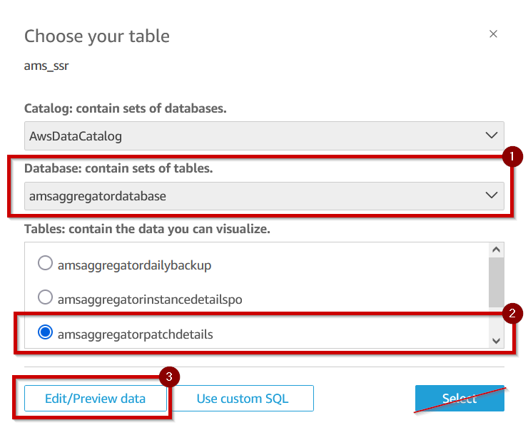

# Example Dashboard - Patch Details

This readme file describes how to create a QuickSight Analysis to visualize AMS Patch Reports and gain useful insights about patch compliance in your organization. The dashboard can be built after deploying the Self Service Aggregator solution and creating a Data Source in Amazon QuickSight that connects to the
`ams-report-aggregator-workgroup` in Amazon Athena.

**N.B. Amazon QuickSight comes with additional charges, and may require you to enter into a subscription. You must, therefore, manually deploy the dashboard after considering QuickSight pricing [at this url](https://aws.amazon.com/quicksight/pricing/).**

## Prerequisites

This readme assumes you have some familiarity with Amazon QuickSight.

## Preview

Thes following screenshots were taken from QuickSight in order to provide examples of the visualizations that are available once you have deployed them into your account.

## Part 1 of 3, create a Data Source in Amazon QuickSight

1. Within QuickSight, select "Datasets" from the navigation pane.
2. Select `New dataset`.

   

3. Select `Athena` from `Create a Dataset 'From new data sources'`.

   

4. Give the Data Source a name (for example, `ams_ssr`), select the `ams-report-aggregator-workgroup`, and select `Create data source`.

   

5. On the `Choose your table` view, select the `amsaggregatordatabase`, select the `amsaggregatorpatchdetails` Table, and select `Edit/Preview data`.

   

6. From the navigation pane's `Fields` section, scroll down until you find fields named `instance_state`, `window_state`, and `reportdate`.
7. From the menu beside `instance_state` and also beside `window_state`, select the option to `Change data type` from `State` to `String`.

   

8. From the menu beside `reportdate`, select the option to `Change data type` from `String` to `Date`. Specify the date as `yyyy-MM-dd`.

   

9. Note that the name of this Data Set is `amsaggregatorpatchdetails`. If you use a different name, you'll have additional work to do later.

   

10. Click on `Save and Publish`.
11. After saving, note the ID of your Dataset from your browser URL.

    

## Part 2 of 3, Edit `skeleton.json`

`skeleton.json` is a file that describes how your QuickSight report will look and feel, as well as the underlying data set to use when building views. You can use `skeleton.json` as an example when building your own QuickSight analysis later on. You can find `skeleton.json` in this repository, and at this URL
[https://github.com/aws-samples/ams-self-service-reporting-aggregator/blob/main/quicksight-examples/patch-details/skeleton.json](https://github.com/aws-samples/ams-self-service-reporting-aggregator/blob/main/quicksight-examples/patch-details/skeleton.json)

1. Edit a copy of `skeleton.json` and update the file with data you received from Step 1, and from information you know about your AWS Account (for example, your AWS Account Id).
2. The following are a list of values that you need to know/provide when updating `skeleton.json`.

   - **AwsAccountId** – the AWS Account ID you are deploying this analysis into
   - **AnalysisId** – Give your analysis an Id, for example `patchsummaryanalysis`
   - **Name** – Give your analysis a name, for example `patchsummaryanalysis`
   - **Permissions** – The `skeleton.json` provides an example QuickSight Administrative user. Later, this Administrative Principal will be able to assign permissions to other Principals who need access to this QuickSight analysis.
   - **Identifier** – This is the name of the DataSet name from Part 1. If you chose a name other than `amsaggregatorpatchdetails`, you'll need to do a find and replace for this value throughout the `skeleton.json`, as there are lots of places where this string needs to exist.

     

   - **DataSetArn** – This is the ARN for the Data Set you created in Part 1. You will need to construct a full ARN from the ID you copied from the browser URL.
     `arn:aws:quicksight:REPLACE_ME_AWS_REGION:REPLACE_ME_AWS_ACCOUNT_ID:dataset/REPLACE_ME_DATA_SET_ID_FROM_BROWSER_ADDRESS_BAR`

## Part 3 of 3, Creating the template in QuickSight

Using the [AWS Command Line Interface (CLI)](https://aws.amazon.com/cli/), run the following command. This command assumes you have adequate QuickSight permissions.

`aws quicksight create-analysis --cli-input-json file://./skeleton.json`

You can monitor your progress with this command

`aws quicksight list-analyses --aws-account-id REPLACEME`

After the template has been deployed, a new analysis will be visible to the Principal you provided in the `Permissions` step above. You are free to edit this example as you see fit. You may wish to change the graphs, and visualizations (or add new ones).

## Security

See [CONTRIBUTING](CONTRIBUTING.md#security-issue-notifications) for more information.
